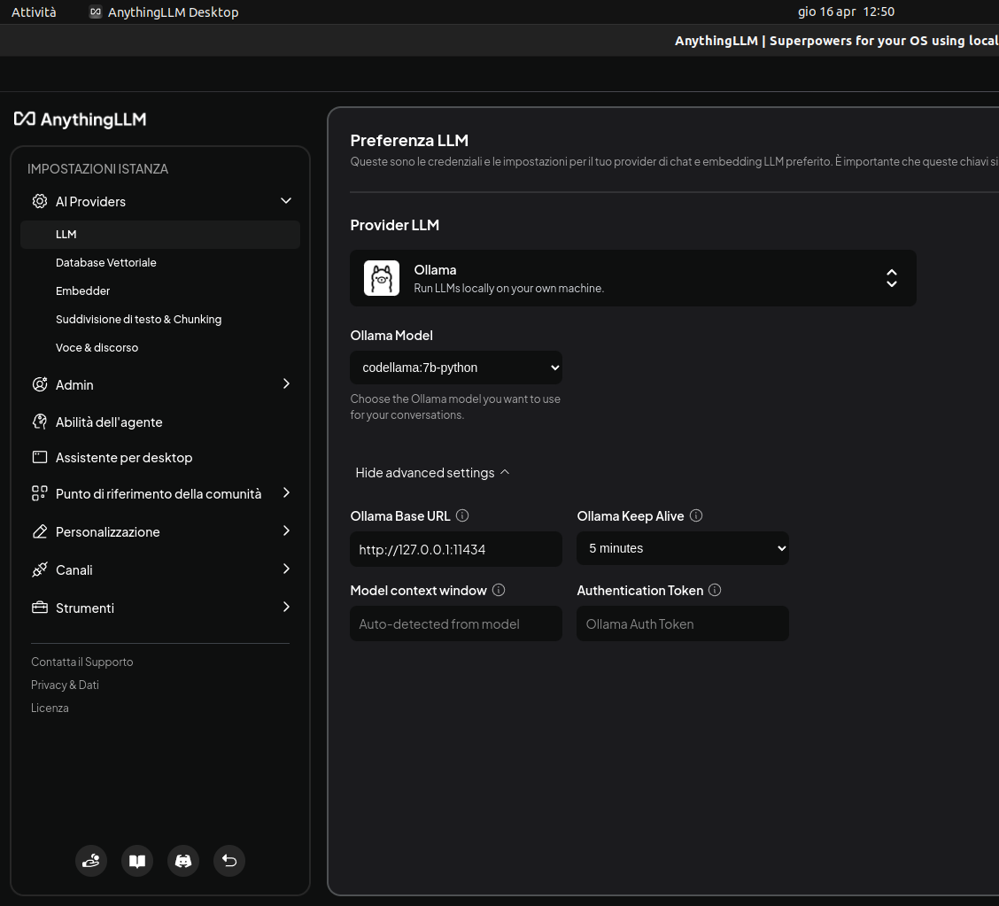

# 💻 6. Guida Operativa all'uso di AnythingLLM

- Scaricare il software
- Assicurarsi di avere il servizio di Ollama attivo con `sudo systemctl status ollama.service`
- Nelle impostazioni si deve solo impostare Ollama come Provider LLM
- Una volta impostato AnythingLLM rileva automaticamente i modelli che abbiamo scaricato, esattamente gli stessi che possiamo visualizzare con `ollama list`

