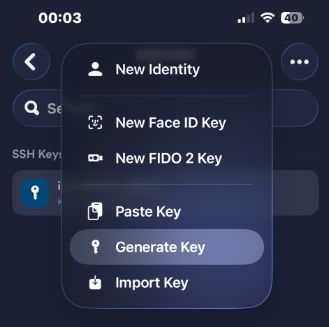
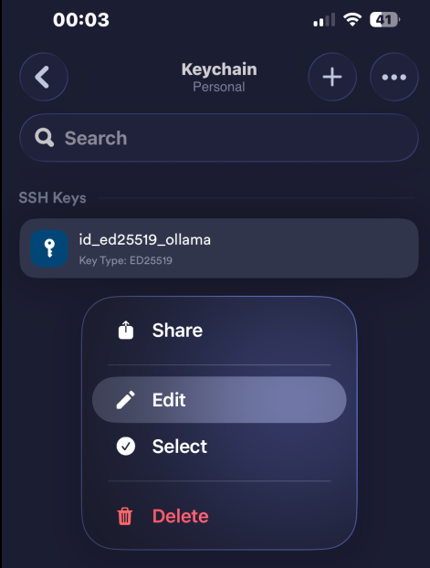
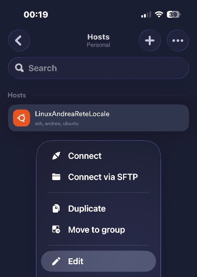
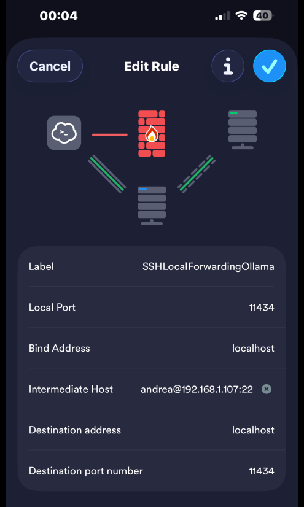
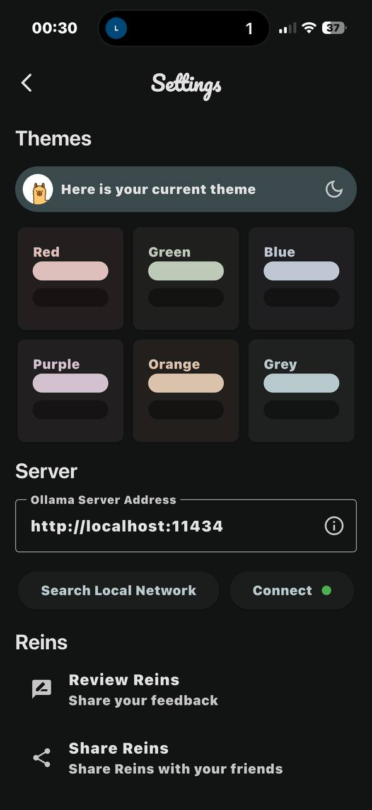
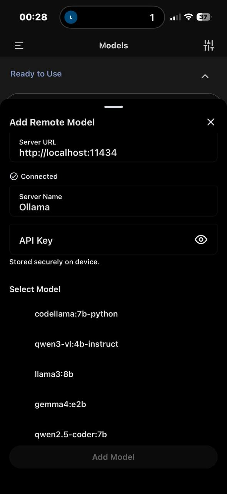

# Configurazione Mobile: Uso dei modelli tramite SSH

Questa sezione descrive come collegare i dispositivi mobili al server Ubuntu sfruttando la potenza della GPU sempre tramite tunnel SSH sicuro.

## 1. Android & iOS: Termius Configuration

Per garantire una connessione sicura dopo aver disabilitato l'autenticazione tramite password (`PasswordAuthentication no`), è necessario configurare correttamente le chiavi e il port forwarding.

### Generazione e Installazione Chiavi
1. **Generazione:** All'interno di Termius, vai in `Settings` > `Keychain` > `Add Key`. 
   - Selezionare **ED25519**.
   - Salvare la chiave e copia la **Public Key**.
2. **Autorizzazione:** Dal server, incollare la chiave pubblica nel file del server: `~/.ssh/authorized_keys`.

### Configurazione Local Port Forwarding
Per permettere al telefono di vedere Ollama, Termius permette di creare un tunnel SSH col local forwarding:
1. Aggiungere l'Host del server in Termius

    
2. Vai nella sezione **Port Forwarding** > **Add Port Forwarding**.
3. Seleziona **Local**:
   - **Bind Address:** `localhost`
   - **Local Port:** `11434`
   - **Destination Host:** `localhost`
   - **Destination Port:** `11434`

    
4. Attiva la connessione SSH. Finché la sessione è aperta, il tunnel è attivo.

## 2. iOS: Collegamento remoto al server con 

Dato che AnythingLLM non è disponibile nativamente su App Store, utilizziamo ad esempio due soluzioni gratuite **Reins (Ollama)** o **PocketPal AI** per interagire con i modelli Ollama presenti sul server tramite il tunnel SSH.

---

## 3. Android: Collegamento al server (AnythingLLM)

Su Android è possibile utilizzare l'app ufficiale di **AnythingLLM**, che permette una gestione completa dei Workspace e del sistema RAG.