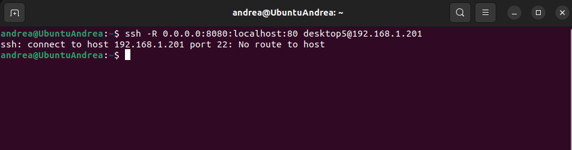
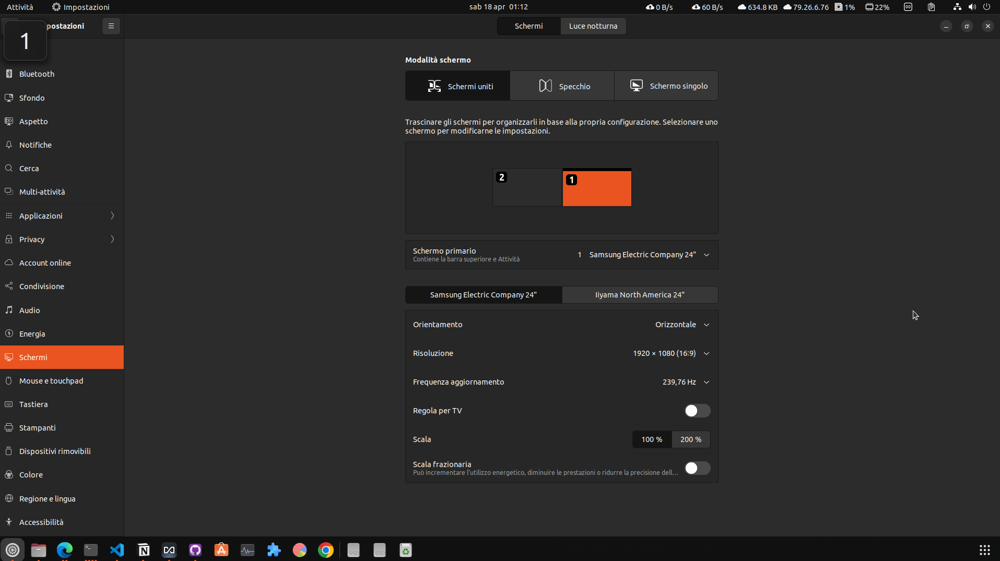
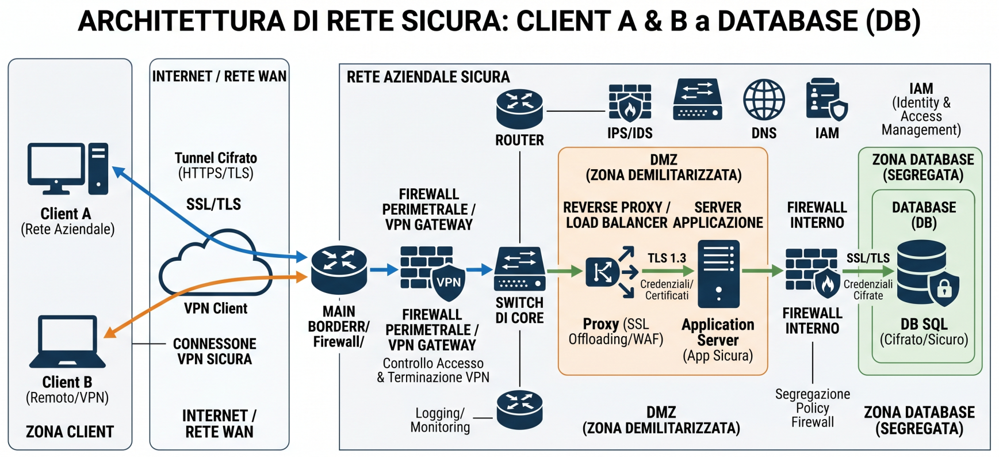
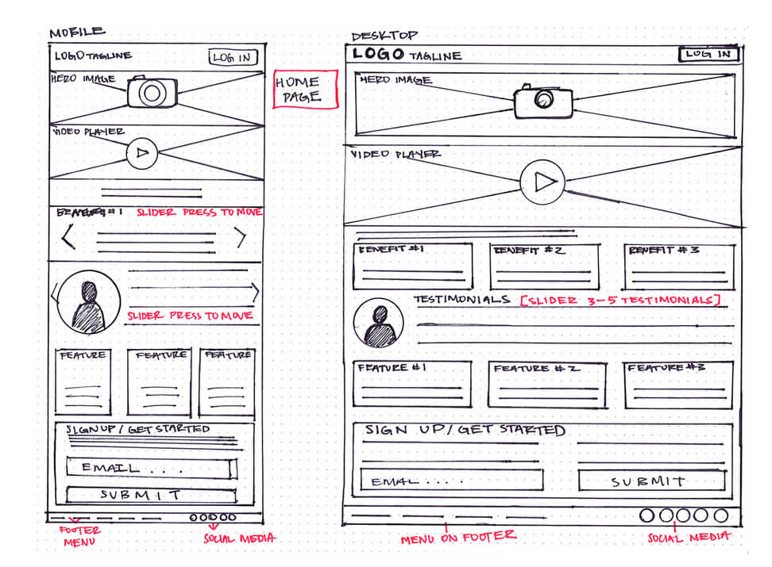

# Testing dei modelli
livelli di difficoltà delle domande (Question Levels):
- Q1: Test di conoscenza base (Fatti).
- Q2: Test di applicazione (Risoluzione problemi semplici).
- Q3: Test di analisi/ottimizzazione (Migliorare qualcosa di esistente).
- Q4: Test di architettura/integrazione (Creare sistemi complessi da zero).
- Q5 (Agentic Behavior): Chiedere al modello di pianificare un intero progetto.
- Q6 (Adversarial/Debugging): Fornire un codice volutamente fallato o con bug di sicurezza nascosti e vedere se il modello li trova.
- Q7 (Creative Synthesis): Chiedere di inventare un nuovo protocollo di comunicazione o un linguaggio di scripting basato su Bash.

## 1. Qwen2.5-Coder:7b & CodeLlama:7b-Python
Questi modelli sono specializzati nella scrittura e nel debugging del codice:

* **Q1 (Basic Syntax):** "Scrivi uno script Bash per Ubuntu che esegua il backup della cartella `/var/log` in un file .tar.gz, aggiungendo il timestamp al nome del file."
* **Q2 (Implementation):** "Crea una funzione Python che utilizzi la libreria `psutil` per monitorare l'uso della CPU e della RAM. Se la RAM supera l'80%, scrivi un alert nel log di sistema tramite `syslog`."
* **Q3 (Optimization/Refactoring):** "Ho questo script Python per analizzare i log di Apache, ma è molto lento su file superiori a 1GB. Come posso ottimizzarlo usando il multiprocessing o i generatori su Ubuntu?"
* **Q4 (System Integration):** "Progetta un file di servizio `systemd` per eseguire uno script Python all'avvio su Ubuntu 22.04, assicurandoti che il servizio si riavvii automaticamente in caso di crash e che scriva gli errori in `/var/log/my_app.err`."

## 2. Llama3:8b & Gemma4:e2b
Modelli generalisti eccellenti per ragionamento, spiegazioni tecniche e assistenza sistemistica:

* **Q1 (Knowledge):** "Quali sono le differenze principali tra il kernel 5.15 (standard di Jammy) e il kernel HWE (Hardware Enablement) su Ubuntu 22.04.5?"
* **Q2 (Troubleshooting):** "Il mio sistema Ubuntu mostra l'errore 'Target packages is configured multiple times' durante un `sudo apt update`. Spiegami perché accade e come risolverlo modificando i file in `/etc/apt/sources.list.d/`."
* **Q3 (Security):** "Configura una policy di base per il firewall `ufw` su un server Ubuntu che deve ospitare un server web (HTTP/HTTPS) e SSH su una porta non standard (es. 2222), bloccando tutto il resto."
* **Q4 (Complex Scenario):** "Spiegami come configurare un bridge di rete per Netplan su Ubuntu 22.04 per l'utilizzo con macchine virtuali KVM, fornendo un esempio di file YAML commentato."

## 3. Qwen3-VL:4b-Instruct
Questo è un modello **Vision-Language**. Per testarlo al meglio, fornirgli un'immagine:

* **Q1 (OCR/Lettura):** [Carica screenshot del terminale con un errore] "Leggi questo output di errore. Quale pacchetto manca per completare la compilazione?"

* **Q2 (Analisi GUI):** [Carica screenshot di 'Impostazioni > Monitor'] "In base a questa immagine, come posso attivare il Fractional Scaling su Ubuntu?"

* **Q3 (Diagramma):** [Carica un diagramma di rete] "Analizza questo schema: quali porte dovrei aprire su Ubuntu per permettere la comunicazione tra il Client A e il Database B?"

* **Q4 (Web Design):** [Carica uno schizzo di un'interfaccia] "Converti questo schizzo in codice HTML/CSS moderno che potrei visualizzare su Firefox su Ubuntu."
